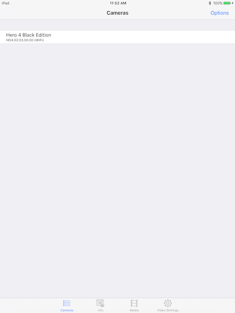
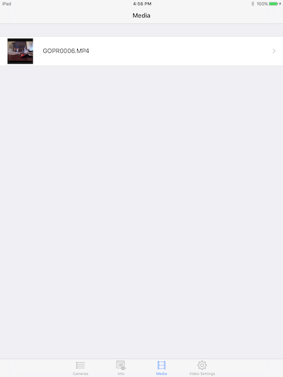
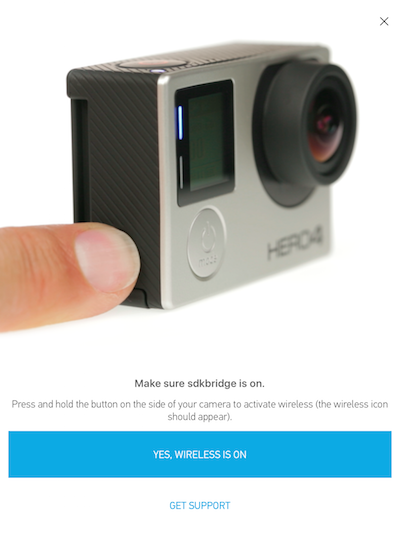
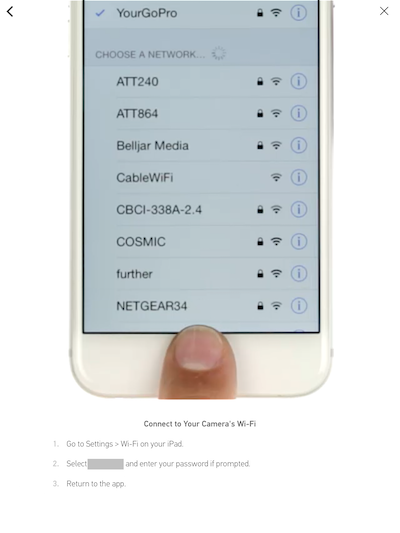

# Getting Started 

To get started, open and run the getting started sample application, 
which illustrates the following functionality:

* Camera discovery
* Live preview streaming
* Triggering the shutter
* Changing camera modes
* Changing video settings (resolution and FPS)
* Fetching the media list from SD card

**Note:** You will need an iOS device (iPhone or iPad) with Bluetooth LE capability.

## Set Up Xcode and Cocoapods

First, you will need to set up Xcode and CocoaPods. Follow these steps:

1. Download and install [Xcode](https://developer.apple.com/xcode/download/) from the App Store. 
2. Install [CocoaPods](https://cocoapods.org), a dependency manager for Swift and Objective-C Cocoa projects. Follow these steps:
    1. Open up the **Terminal** application.
    2. Type these commands:

            sudo gem install cocoapods
            pod setup

## Pairing the Camera and Device

The first time you pair the camera and the device, you must use the official GoPro iOS app. Follow the
instructions at [How to Pair the Camera with the GoPro App](https://www.gopro.com/support/articles/how-to-pair-the-camera-with-the-gopro-app).

**Note:** You only need to use the official GoPro app the first time you pair a camera and a device.
During first time pairing, the GoPro app sets up camera-related settings in your device, such as
storing the SSID and password. 
Any future pairings are referred to as re-connection and the official GoPro app is not required. 
You can directly turn on the Wi-Fi network of the camera and connect to it from the mobile device you are using.

**Note:** The device may attempt to connect to other networks. If it successfully connects to another network, 
it will lose the connection with the camera.

## Running the Sample Application

Set up the sample application with the correct dependencies and open the workspace in Xcode
through the terminal.

**Note:** Because the sample application project uses CocoaPods, you must open it through 
the terminal, and not through the Finder.

Follow these steps to set up the sample app:

1. In the terminal, change directory to the **Downloads** folder in the iOS WSDK folder.
2. Type this command to change directory into the sample application folder:

        cd Sample\ Application

3. Type this command to import and install the required libraries:

        pod install

4. Open the sample application workspace with this command:

        open WSDK.xcworkspace

Next, you will build and run the sample app project in Xcode. 

**Note:** The instructions below are for running the code
on an iOS device. You can also run the app through the simulator, but 
discovery and pairing will work differently than
on a device because the simulator does not support Bluetooth.

1. From the **Product** menu, choose **Build**. If you get a signing error, click the **Fix** button.
2. Attach an iOS device to your computer through USB. 
3. From the **Product** menu, choose **Run**. (Or click the Run triangle.) The WSDK app should appear on your device.
4. You will see a list of cameras, which will be empty. Swipe down on the screen to refresh the list. Your camera should be listed now. </br>
    
5. Tap on your camera in the list. You will now see the **Info** tab, which contains a preview video and other information.</br>
    
6. Select a different mode, such as **Photo**. The camera will switch modes.
7. Tap on **Capture** to start the video (in video mode) or to take a photo (in photo mode).
8. Tap on the **Media** button at the bottom to see a list of media on the SD card. The first time it will be empty, so swipe down to refresh the list.</br>
    
9. Tap on **Video Settings** to change the video settings. You will see them update in the camera.

## Examining the Code

Let's look at the code to see how the various features work.

### Camera Discovery

To write code for the camera discovery process, follow these steps:

1. Create an object responsible for discovering and connecting to the camera. Have it conform to the **GPCameraScannerListener** and **GPCameraConnectorDelegate** protocols.
2. Initialize a **GPCameraScanner** object with the desired **GPCameraScannerOption** using the **initWithOption** initializer.
3. Set the **delegate** property of the **GPCameraScanner** instance to your **GPCameraConnectorDelegate**.
3. Call the **start** method on the scanner. **GPCameraScanResult** objects are asynchronously returned via the **GPCameraScannerListener** delegate methods. You can retrieve basic information about a discovered camera including **displayName**, **identifier**, and **model**.

#### Objective-C

```objc
self.cameraScanner = [[GPCameraScanner alloc] initWithNetworkType:GPCameraScannerOptionWiFi];
self.cameraScanner.delegate = self;
[self.cameraScanner start];
```

### Camera Connection

Once the user has selected a camera, use these steps to connect to it.

1. Call **stop** on your **GPCameraScanner** instance.
2. Invoke **connectionRequestForCameraScanResult** on the **GPCameraScanner** with the desired **GPCameraScanResult** object as a parameter. A **GPConnectionRequest** object is returned.
3. Create an instance of **GPCameraConnector**.
4. Invoke the **connect:** method on the **GPCameraConnector** with the
**GPConnectionRequest** passed in as a parameter.
5. Your **GPCameraConnectorDelegate** methods will be called to indicate the outcome of the connection request. Once you get a **GPCamera** object, you are connected to the camera that it represents.

The following snippet gets the **GPConnectionRequest** and connects to the camera.

#### Objective-C

```objc
// user has selected a camera scan result to connect to

self.cameraCollection.selectedCamera = nil;
[self.cameraScanner stop];

GPCameraScanResult *scanResult = self.cameraScanner.scanResults[indexPath.row];
GPConnectionRequest *connectionRequest = [self.cameraScanner connectionRequestForCameraScanResult:scanResult];

[self.connector connect:connectionRequest];
```

### Controlling Recording

Once you are connected to the camera, you can control the shutter and other camera functionality
with the **GPCamera (Control)** class. Use these steps to control the shutter:

1. Set the camera settings using the **GPCamera** class.
2. Set the camera mode using the **GPCameraMode** class.
3. Use the **GPCamera setShutter:** method and pass it the value **YES** to start capturing.

## Notes for Creating Your Own App

### Disable AppTransportSecurity

For iOS 9, all unsecured HTTP traffic from iOS apps is disabled, as a part of App Transport Security (ATS).
Apple treats the communication between iOS devices and the GoPro camera as unsecured HTTP traffic,
which mean that with ATS enabled, HTTP requests to the GoPro camera will result in errors like this:

    Error Domain=NSURLErrorDomain Code=-1004 "Could not connect to the server." UserInfo=0x12ed5bad0 {NSUnderlyingError=0x12ee495b0 "The operation couldn’t be completed. (kCFErrorDomainCFNetwork error -1004.)"

or

    NSURLSession/NSURLConnection HTTP load failed (kCFStreamErrorDomainSSL, -9802)

or

    App Transport Security has blocked a cleartext HTTP (http://) resource load since it is insecure. Temporary exceptions can be configured via your app's Info.plist file.

To disable ATS, open `Info.plist`, and add the following lines:

    <key>NSAppTransportSecurity</key>
    <dict>
        <key>NSAllowsArbitraryLoads</key>
        <true/>
    </dict>

**Note:** In the sample app, ATS is disabled.

### Implement a UI to Help with Device Pairing

Your app's users will need to change the Wi-Fi settings of their device in order to 
connect to the camera's Wi-Fi. We recommend that your app creates a user experience
that leads the user through the steps necessary to do this.

For an example on how to do this, look at the GoPro official iOS app. The screenshots
below illustrate how this is done in the GoPro app.






